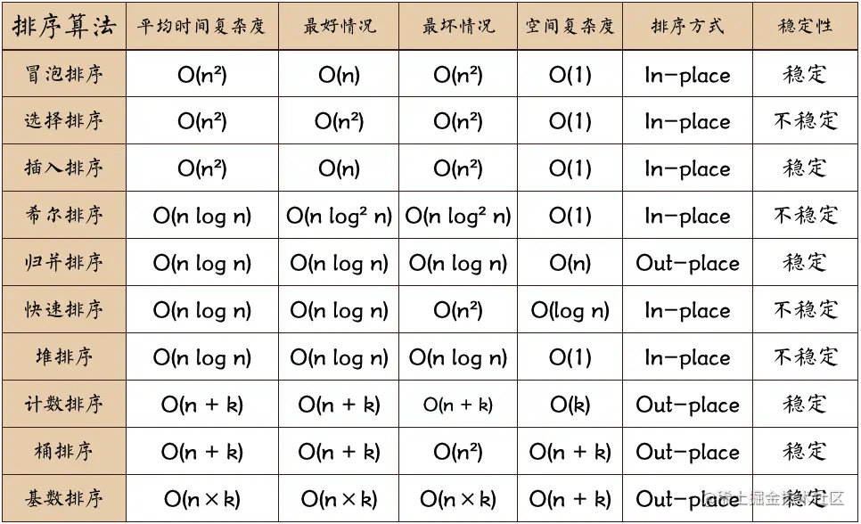
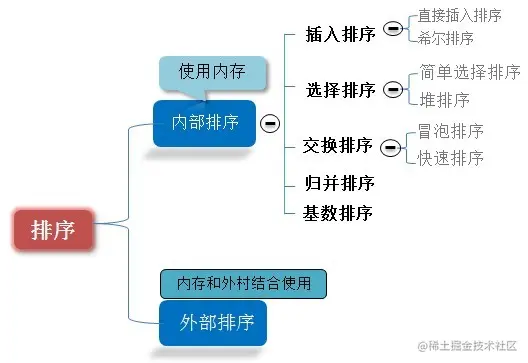

<style>
img{
    width: 500px;
    /* padding-left: 20%; */
    align=left;
}
</style>

# 排序
十大排序算法归纳  
    
 n: 数据规模 k:桶的个数  
 In-place: 占用常数内存，不占用额外内存 Out-place: 占用额外内存  

  

### 1、冒泡排序
两两交换，大的放在后面，第一次排序后最大值已在数组末尾。
因为两两交换，需要n-1趟排序，比如10个数，需要9趟排序

代码实现要点：

    两个for循环，外层循环控制排序的趟数，内层循环控制比较的次数
    每趟过后，比较的次数都应该要减1
    优化：如果一趟排序后也没有交换位置，那么该数组已有序
```javascript
function bubbleSort(arr){
  if(arr.length<=1) return arr;
  let isChange;  //标志
  for(let i = 0; i<arr.length-1; i++){
    isChange = 0;  //每比较一趟就重新初始化为0
    for(let j = 0; j<arr.length-1-i;j++){
      if(arr[j]>arr[j+1]){
        [arr[j],arr[j+1]] = [arr[j+1],arr[j]];  //交换
        isChange = 1;
      }
    }
    if(isChange == 0){  //优化：如果比较完一趟没有发生置换，那么说明已经排好序了，跳出最外面的循环结束
      break;
    }
  }
  return arr;
}
console.log(bubbleSort([5,3,2,7,8,4,6,3,1]))
```
### 2、选择排序
找到数组中最大的元素，与数组最后一位元素交换  
当只有一个数时，则不需要选择了，因此需要n-1趟排序，比如10个数，需要9趟排序  
代码实现要点：

    两个for循环，外层循环控制排序的趟数，内层循环找到当前趟数的最大值，随后与当前趟数组最后的一位元素交换
```javascript
//这个是找当前趟的最大的元素，放到当前趟数组的最后一位
function selectSort(arr){
  if(arr.length<=1) return arr;
  let maxIndex;
  for(let i=0; i<arr.length-1; i++){
      maxIndex = 0;
      for(let j = 0; j <arr.length-i; j++){
         if(arr[j]>arr[maxIndex]) 
            maxIndex = j;
      }
      [arr[maxIndex],arr[arr.length-1-i]] = [arr[arr.length-1-i],arr[maxIndex]];
  }
   return arr;
}
console.log(selectSort([5,3,2,7,8,4,6,3,1]))

//下面这个是找当前趟的最小的元素，放到当前趟数组的第一位
function selectSort(arr){
   if(arr.length<=1) return arr;
   let minIndex;
   for(let i=0; i<arr.length-1; i++){
      minIndex = i;  //每次开始比较的位置
      for(let j=i+1; j <arr.length-i; j++){
         if(arr[j]<arr[minIndex]) 
            minIndex = j;
      }
      [arr[i],arr[minIndex]] = [arr[minIndex],arr[i]];
   }
   return arr;
}
```

### 3、插入排序
将一个元素插入到已有序的数组中，在初始时未知是否存在有序的数据，因此将元素第一个元素看成是有序的。与有序的数组进行比较，比它大则直接放入，比它小则移动数组元素的位置，找到个合适的位置插入。  
当只有一个数时，则不需要插入了，因此需要n-1趟排序，比如10个数，需要9趟排序  
代码实现：

    一个for循环内嵌一个while循环实现，外层for循环控制需要排序的趟数，while循环找到合适的插入位置(并且插入的位置不能小于0)
```javascript
function insertSort(arr){
  if(arr.length<=1) return arr;
  let pre, cur;
  for(let i=1;i <arr.length;i++){  //将第0位看成了有序数据
    pre = i-1;
    cur = arr[i];
    while(pre>=0&&arr[pre]>cur){
      arr[pre+1]= arr[pre];   //放到后面一个位置
      pre--;      //不断往前，直到退出循环
    }
    arr[pre+1] = cur;  //退出循环说明找到了合适的位置了
  }
  return arr;
}
console.log(insertSort([5,3,2,7,8,4,6,3,1]))
```

### 4、希尔排序
希尔排序实质上就是插入排序的增强版。它与插入排序的不同之处在于，它会优先比较距离较远的元素。希尔排序又叫缩小增量排序。  
希尔排序的核心在于间隔序列的设定。既可以提前设定好间隔序列，也可以动态地定义间隔序列。  
代码实现：

    先将整个待排序的记录序列分割成为若干子序列分别进行直接插入排序，具体算法描述：
    1.选择一个增量序列t1，t2，…，tk，其中ti>tj，tk=1；
    2.按增量序列个数k，对序列进行k 趟排序；
    3.每趟排序，根据对应的增量ti，将待排序列分割成若干长度为m的子序列，分别对各子表进行直接插入排序。仅增量因子为1时，整个序列作为一个表来处理，表长度即为整个序列的长度

希尔排序将数组分隔成n组来进行插入排序，直至该数组宏观上有序，最后再进行插入排序时就不用移动那么多次位置了  
下面这个代码就是一开始是增量为4，后面增量是1，增量为4就是间隔4个比较
```javascript
function shellSort(arr){
  if(arr.length<=1) return arr;
  let gap = 1;
  while(gap<(arr.length/3)){  //动态定义间隔序列
    gap = gap *3 +1;
  }
  let pre,cur;
  for(gap; gap>0; gap = Math.floor(gap/3)){
    for(let i = gap; i<arr.length; i++){
        pre = i-gap;
        cur = arr[i];
        while(pre>=0 && arr[pre]>cur){
          arr[pre+gap] = arr[pre];
          pre -= gap;
        }
        arr[pre+gap] = cur;
    }
  }
  return arr;
}
console.log(shellSort([5,3,2,7,8,4,6,3,1]))
```

### 5、归并排序
将两个已排好序的数组合并成一个有序的数组。  
将元素分隔开来，看成是有序的数组，进行比较合并，不断拆分和合并，直到只有一个元素。
代码实现：

    1.把长度为n的输入序列分成两个长度为n/2的子序列；
    2.对这两个子序列分别采用归并排序；
    3.将两个排序好的子序列合并成一个最终的排序序列。
也就是先让子序列变得有序，再它们合并
```javascript
function mergeSort(arr){
  if(arr.length<=1) return arr;
  let middle = Math.floor(arr.length/2);
  let left = arr.slice(0,middle); //取0~middle-1
  let right = arr.slice(middle);  //取middle~arr.length-1
  return merge(mergeSort(left),mergeSort(right));
}
function merge(left,right){
  let res = [];
  while(left.length && right.length){  //这里让两个序列插入后有序
      if(left[0]<right[0]) {
        res.push(left.shift())  //shift踢掉数组的第一个元素
      }
      else {
        res.push(right.shift());
      }
  }
  while(left.length) res.push(left.shift());
  while(right.length) res.push(right.shift());
  return res;
}
var arr = mergeSort([1,0,56,14,13,45,1]); 
console.log(arr);
```
先合并[0][56],然后合并[1],[0,56],接着合并[14][13],合并[45][1],合并[13,14][1,45],最后合并[0,1,56][1,13,14,45]

### 6、快速排序
通过一趟排序将待排记录分隔成独立的两部分，其中一部分记录的关键字均比另一部分的关键字小，则可分别对这两部分记录继续进行排序，以达到整个序列有序。
代码实现： 

    快速排序用递归比较好写。
    支点先取left-1，通过left与right比较，如果left值小等于right值，pivot+1，把left值放到pivot的位置，如果left值大于right值的话，不做任何操作，pivot不变，判断直到right处，这样能保证pivot的左边都是比pivot小的，右边都是比它大的
    递归left到pivot前一个元素(执行相同的操作,同上)
    递归pivot后一个元素到right元素(执行相同的操作,同上)
    
```javascript
function quickSort(arr,left,right){
  if(arr.length<=1) return arr;
  left = left===undefined ? 0:left
  right = right===undefined ? (arr.length-1):right;
  if(left<right){
    var x = arr[right], pivot= left - 1;
    for (var j = left; j <= right; j++) {  //找pivot
      if (arr[j] <= x) {
        pivot++;
        [arr[pivot],arr[j]] = [arr[j],arr[pivot]]; //交换，让pivot的左边都是比它小的
      }
    }
    quickSort(arr,left,pivot-1);   //递归
    quickSort(arr,pivot+1,right);
  }
  return arr;
}
var arr = quickSort([32,12,11,78,76,45,36]);
console.log(arr);
```

### 7、堆排序
堆排序可以说是一种利用堆的概念来排序的选择排序。  
堆积是一个近似完全二叉树的结构，并同时满足堆积的性质：即子结点的键值或索引总是小于（或者大于）它的父节点。  
代码实现：

    1.将初始待排序关键字序列(R1,R2....Rn)构建成大顶堆，此堆为初始的无序区；
    2.将堆顶元素R[1]与最后一个元素R[n]交换，此时得到新的无序区(R1,R2,......Rn-1)和新的有序区(Rn),且满足R[1,2...n-1]<=R[n]；
    3.由于交换后新的堆顶R[1]可能违反堆的性质，因此需要对当前无序区(R1,R2,......Rn-1)调整为新堆，然后再次将R[1]与无序区最后一个元素交换，得到新的无序区(R1,R2....Rn-2)和新的有序区(Rn-1,Rn)。不断重复此过程直到有序区的元素个数为n-1，则整个排序过程完成。
```javascript
function heapSort(arr){
  if(arr.length<=1) return arr;
  buildMaxHeap(arr);  //初始创建堆
  for(let i = arr.length-1; i>=0;i--){
    [arr[i],arr[0]]= [arr[0],arr[i]];  //交换堆顶和无序区末尾
    heapify(arr,0,i);  //继续保证堆的性质
  }
  return arr;
}
function buildMaxHeap(arr){
  if(arr.length<=1) return arr;
  let middle = parseInt(arr.length/2);  //同样是向下取整
  for(let i = middle; i>=0; i--){
    heapify(arr,i,arr.length);
  }
}
function heapify(arr,i,len){  //维护堆的性质
  let left = 2*i+1,right = 2*i+2,largest = i;
  if(left < len && arr[left]>arr[largest]) largest = left;
  if(right< len && arr[right]>arr[largest]) largest = right;
  if(largest!=i){
    [arr[i],arr[largest]] = [arr[largest],arr[i]];
    heapify(arr,largest,len);
  }
}
console.log(heapSort([5,3,2,7,8,4,6,3,1]))
```

### 8、计数排序
计数排序的核心在于将输入的数据值转化为键存储在额外开辟的数组空间中。 
计数排序使用一个额外的数组C，其中第i个元素是待排序数组A中值等于i的元素的个数。然后根据数组C来将A中的元素排到正确的位置。它只能对整数进行排序。
代码实现：

  1.统计数组中每个值为i的元素出现的次数，存入数组count的第i项，count数组的长度就等于最大的数+1；
  2.逐个判断count数字中是否存在第i项，或者第i项是否>0，是的话就填充原数组arr中，每放一个元素就将count[i]减去1

```javascript
function countSort(arr){
  if(arr.length<= 1) return arr;
  let count = [];
  for(let num of arr){   //统计个数 例如最大数是99，那就会有count[99]，这样count.length=100
    if(!count[num]) count[num]= 0;
    count[num]++;
  }
  let pos = 0;
  for(let i = 0; i< count.length; i++){
    while(count[i]){
      arr[pos++] = i;
      count[i]--;
    }
  }
  return arr;
}
console.log(countSort([2, 2, 3, 8, 3, 7, 8, 99, 3, 2]))
```

### 9、桶排序
桶排序是计数排序的升级版。它利用了函数的映射关系，高效与否的关键就在于这个映射函数的确定。  
桶排序的工作原理：假设输入数据服从均匀分布，将数据分到有限数量的桶里，每个桶再分别排序（有可能再使用别的排序算法或是以递归方式继续使用桶排序进行排序）  
代码实现：

  1.设置一个定量的数组当作空桶；
  2.遍历输入数据，并且把数据一个一个放到对应的桶里去；
  3.对每个不是空的桶进行排序；
  4.从不是空的桶里把排好序的数据拼接起来。

桶排序就是减少排序的范围
```javascript
//num表示桶内最多能装多少元素
function bucketSort(arr,bucketSize){
  if(arr.length<=1) return arr;
  let max = 0, min  = 0;
  for(let num of arr){  //找数组中最大和最小元素
    if(num < min) min = num;
    if(num > max) max = num;
  };
  let bucketCount = Math.floor((max-min)/bucketSize)+1;
  let buckets = Array.from({length:bucketCount},x=>[]);
  for(let num of arr){
     buckets[Math.floor((num-min)/bucketSize)].push(num); //在这里，桶与桶之间是有序的
  };
  let pos = 0;
  for(let i = 0; i<buckets.length; i++){
     if(buckets[i]){
        insertSort(buckets[i]) //桶内排序，这里用的是插入排序法
        for(let j = 0; j < buckets[i].length; j++){
           arr[pos++] = buckets[i][j];  
        }
     }
  }
  return arr;
}
function insertSort(arr){
  if(arr.length <=1) return arr;
  var pre, cur;
  for(let i = 1; i < arr.length; i++){
    pre = i-1;
    cur = arr[i];
    while(pre >=0 && arr[pre]>cur){
      arr[pre+1] = arr[pre];
      pre--;
    }
    arr[pre+1] = cur;
  }
  return arr;
}

 var arr = bucketSort([3,44,38,5,47,15,36,26,27,2,46,4,19,50,48],4)
 console.log(arr)
```

### 10、基数排序
基数排序是按照低位先排序，然后收集；再按照高位排序，然后再收集；依次类推，直到最高位。有时候有些属性是有优先级顺序的，先按低优先级排序，再按高优先级排序。最后的次序就是高优先级高的在前，高优先级相同的低优先级高的在前。基数排序基于分别排序，分别收集，所以是稳定的。  
基数排序法可以理解为它是按照每个元素的位数来排的，先按最低位，然后是最高位，需要给定位数，或者先计算最大值，然后算位数。注意大循环。  
代码实现：

  1.取得数组中的最大数，并取得位数/或者给定最大位数，直接调用；
  2.arr为原始数组，从最低位开始取每个位组成radix数组；
  3.对radix进行计数排序（利用计数排序适用于小范围数的特点）；

可以理解为从低位开始排，就可以让高位相同的数之间按照低位的高低排好了
```javascript
function radixSort(arr,maxDigit){
  if(arr.length<= 1) return arr;
  let count = [];
  let dev = 1, mod = 10;
  for(let i = 0; i<maxDigit; i++,dev*=10,mod*=10){//注意这里是大循环啊，第一圈下来变成[1,3,4,5,26,6,8]，在这个基础上做第二圈，所以可以
     for(let j = 0; j< arr.length; j++){
       let digit = parseInt((arr[j] % mod) / dev)
       if(!count[digit]) count[digit] = [];
       count[digit].push(arr[j]);
     }  
     let pos = 0;
     for(let j = 0; j < count.length; j++){
        if(count[j]){   //每次只放一个数出来，所以从低位开始收集
            let value;
            while((value = count[j].shift())){
               arr[pos++] = value;
            }
         }
     }
  }
  return arr;
}
var arr = radixSort([22,35,14,68,97,20,26,75],2)
console.log(arr)
```

